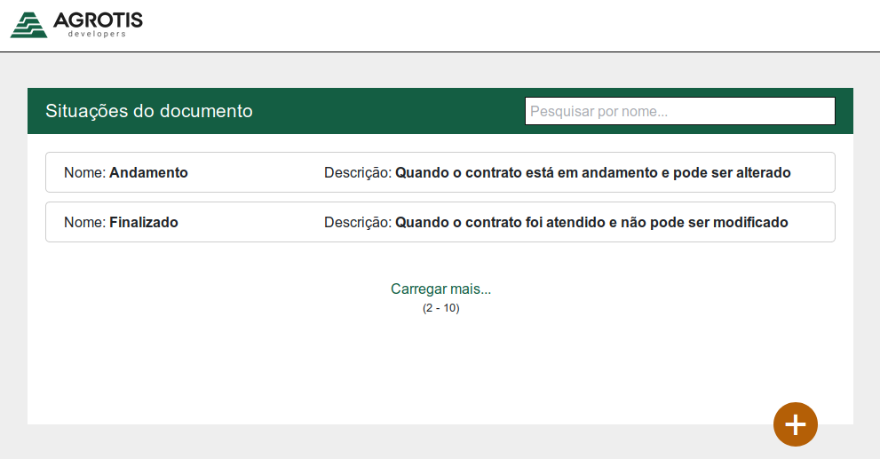

# Incidents list [React]
In this repository I created an incident list using React. 

The repository where I take the challenge from is [this](https://github.com/agrotis-io/desafio-front). Fell free to take the test too!

Here's a list of features this app have:
- Show a list of items 
- Filter items by name
- Add more items via a form
- Load more items via JS

I used React, React Router and Bootstrap to build this.

## Run locally
To run this project locally you need to install all the dependencies:
`npm install`

And to serve the localhost website run:
`npm start`